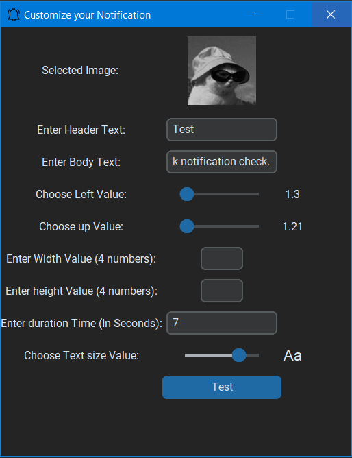
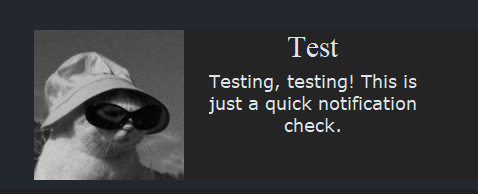

# Custom Notification GUI

This Python application allows you to create and preview customizable notifications with custom parameters.

## Getting Started

### Prerequisites

To use this application, ensure you have the following installed:

#### 1- Requirement
- Python 3.x installed on your system.
- Required Python packages installed. You can install them using pip:
  ```bash
  pip install customtkinter pystray Pillow screeninfo
#### 2- Running the Application:
- Clone the repository:
    ```bash
    git clone https://github.com/Hamdy20002/Custom_Notification.git
    cd Custom_Notification
- Run the main script to Run Gui:
    ```bash
    python GUI.py

### Application Overview

#### **GUI Functionality**

The GUI script (GUI.py) opens a graphical interface where you can:

- Select an image to display alongside the notification.
- Enter header text and body text for the notification.
- Adjust notification position, width, height, duration, and text size using sliders and input fields.

#### **Notification Function**

The Custom_Notify function (Notification.py) displays a notification window with the specified parameters:

- img_path: Path to the optional image file to display.
- header_text: Text displayed as the header of the notification.
- input_text: Text content displayed in the notification body.
- left, up: Positioning factors relative to the screen size.
- width, height: Dimensions of the notification window.
- duration: Duration in seconds for which the notification will be displayed.
- text_size: Font size for text in the notification.

The notification window animates into view from the right side of the screen and disappears after the specified duration.

# Example Usage

## GUI



## Notification



